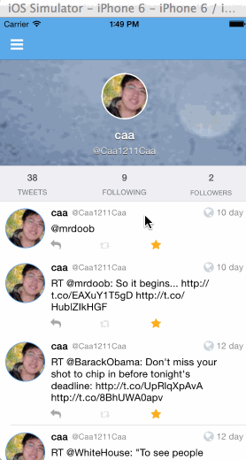

## ios-Twitter-client

This is a basic twitter app to read and compose tweets the [Twitter API](https://apps.twitter.com/).

Time spent: `<Number of hours spent>`

#### Hamburger menu
- [X] Dragging anywhere in the view should reveal the menu.
- [X] The menu should include links to your profile, the home timeline, and the mentions view.
- [X] The menu can look similar to the LinkedIn menu below or feel free to take liberty with the UI.

#### Profile page
- [X] Contains the user header view
- [X] Contains a section with the users basic stats: # tweets, # following, # followers
- [ ] Optional: Implement the paging view for the user description.
- [ ] Optional: As the paging view moves, increase the opacity of the background screen. See the actual Twitter app for this effect
- [X] Optional: Pulling down the profile page should blur and resize the header image.

#### Home Timeline
- [X] Tapping on a user image should bring up that user's profile page

#### Optional: Account switching
- [ ] Long press on tab bar to bring up Account view with animation
- [X] Tap account to switch to
- [ ] Include a plus button to Add an Account
- [ ] Swipe to delete an account

### Walkthrough

